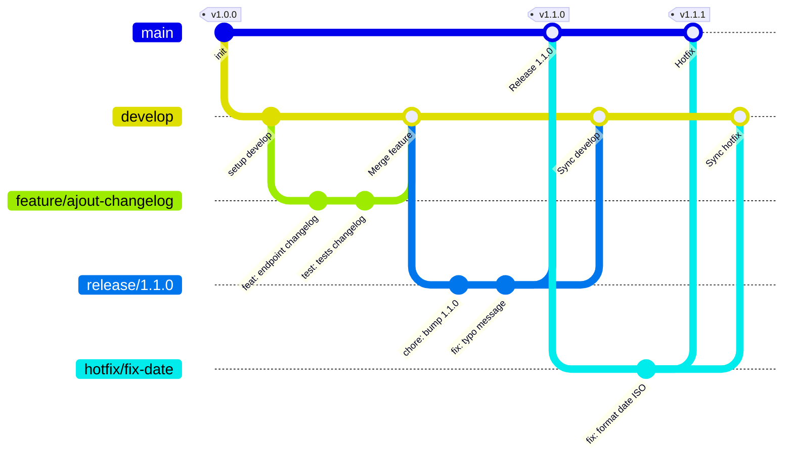
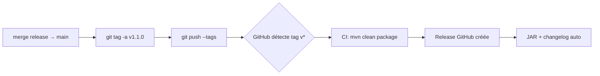

# Hello Versioning — Git Flow Demo

Projet Spring Boot minimaliste conçu comme **support pédagogique** pour apprendre et pratiquer la stratégie de **versioning Git Flow** avec **Semantic Versioning (SemVer)**.

---

## Prérequis

- Java 17+
- Maven 3.8+
- Git

## Lancer le projet

```bash
cd architecture-java/HelloVersioning
mvn spring-boot:run
```

Endpoints disponibles :
| Endpoint | Description |
|----------|-------------|
| `GET /` | Message de bienvenue + version |
| `GET /version` | Infos détaillées (version, java, timestamp) |
| `GET /health` | Statut de l'application |

```bash
curl http://localhost:8080/version
# {"application":"hello-versioning","version":"1.0.0","java":"17.x","timestamp":"..."}
```

---

## Stratégie de Versioning : Git Flow + SemVer

### Semantic Versioning (SemVer)

Le numéro de version suit le format **MAJOR.MINOR.PATCH** :

| Segment | Quand incrémenter | Exemple |
|---------|-------------------|---------|
| **MAJOR** | Changement cassant (API incompatible) | Renommer `/version` en `/api/v2/info` |
| **MINOR** | Nouvelle fonctionnalité rétrocompatible | Ajouter `GET /changelog` |
| **PATCH** | Correctif de bug | Fix du format de date dans `/version` |

### Pourquoi Git Flow ?

Git Flow offre une **structure claire** avec des branches dédiées à chaque rôle. Même en petite équipe (1-5 devs), il apporte :
- Une séparation nette entre production et développement
- Des releases contrôlées et traçables
- Un processus de hotfix d'urgence bien défini

---

## Structure des branches

```
main         ← Production stable, toujours déployable
│
├── develop  ← Intégration continue, base des features
│   │
│   ├── feature/ajout-changelog   ← Nouvelle fonctionnalité
│   └── feature/endpoint-info     ← Autre fonctionnalité
│
├── release/1.1.0  ← Stabilisation avant mise en production
│
└── hotfix/fix-date-format  ← Correctif urgent en production
```

### Schéma du cycle de vie



---

## Guide Pratique Git Flow — Commandes pas à pas

### 0. Initialisation (une seule fois)

```bash
# Créer la branche develop à partir de main
git checkout main
git checkout -b develop
git push -u origin develop
```

### 1. Créer une feature

```bash
# Toujours partir de develop
git checkout develop
git pull origin develop
git checkout -b feature/ajout-changelog

# Développer...
git add .
git commit -m "feat: ajout endpoint GET /changelog"

# Terminer la feature → merge dans develop
git checkout develop
git merge --no-ff feature/ajout-changelog -m "Merge feature/ajout-changelog into develop"
git push origin develop
git branch -d feature/ajout-changelog
```

> **`--no-ff` (no fast-forward)** : Crée toujours un commit de merge, même si le merge est trivial. Cela permet de voir dans l'historique exactement quand et quoi a été mergé.

### 2. Préparer une release

```bash
# Créer la branche release depuis develop
git checkout develop
git checkout -b release/1.1.0

# Bumper la version dans pom.xml ET application.properties
# pom.xml        : <version>1.1.0</version>
# app.properties : app.version=1.1.0
git commit -am "chore: bump version to 1.1.0"

# Corrections de dernière minute si nécessaire
git commit -m "fix: correction message d'accueil"
```

### 3. Finaliser la release

```bash
# Merge dans main (production)
git checkout main
git merge --no-ff release/1.1.0 -m "Release 1.1.0"
git tag -a v1.1.0 -m "Version 1.1.0 - Ajout changelog"

# Merge retour dans develop (récupérer les fixes de stabilisation)
git checkout develop
git merge --no-ff release/1.1.0 -m "Merge release/1.1.0 back into develop"

# Nettoyage et push
git branch -d release/1.1.0
git push origin main develop --tags
```

### 4. Hotfix d'urgence

Scénario : Le endpoint `/version` renvoie une date mal formatée en production.

```bash
# Partir de main (production actuelle)
git checkout main
git checkout -b hotfix/fix-date-format

# Corriger le bug
git commit -m "fix: format date ISO 8601 dans /version"

# Merge dans main + tag
git checkout main
git merge --no-ff hotfix/fix-date-format -m "Hotfix 1.1.1"
git tag -a v1.1.1 -m "Version 1.1.1 - Fix format date"

# Merge retour dans develop (sinon le bug revient !)
git checkout develop
git merge --no-ff hotfix/fix-date-format -m "Merge hotfix into develop"

# Nettoyage et push
git branch -d hotfix/fix-date-format
git push origin main develop --tags
```

---

## Conventions de nommage

### Branches

```
feature/ajout-changelog       ✅  Descriptif, kebab-case
feature/endpoint-info         ✅
hotfix/fix-date-format        ✅
release/1.1.0                 ✅  Numéro SemVer
feature/truc                  ❌  Trop vague
Feature/Changelog             ❌  Pas de majuscules
```

### Commits — Conventional Commits

| Préfixe | Quand | Exemple concret |
|---------|-------|-----------------|
| `feat:` | Nouvelle fonctionnalité | `feat: ajout endpoint GET /changelog` |
| `fix:` | Correction de bug | `fix: format date ISO dans /version` |
| `docs:` | Documentation | `docs: ajout section hotfix dans README` |
| `refactor:` | Restructuration sans changement fonctionnel | `refactor: extraction constantes de version` |
| `test:` | Ajout/modification de tests | `test: ajout test endpoint /health` |
| `chore:` | Tâches de maintenance | `chore: bump version to 1.1.0` |
| `feat!:` | Changement cassant | `feat!: renommage /version en /api/v2/info` |

### Tags

```
v1.0.0    ✅  Préfixe "v" + SemVer complet
1.0.0     ❌  Pas de préfixe
v1.0      ❌  Incomplet (manque PATCH)
```

---

## Automatisation CI/CD — GitHub Actions

### Workflow CI (sur chaque PR / push)

Créer `.github/workflows/ci.yml` :

```yaml
name: CI - Build & Tests

on:
  push:
    branches: [main, develop]
  pull_request:
    branches: [main, develop]

jobs:
  build:
    runs-on: ubuntu-latest
    steps:
      - name: Checkout
        uses: actions/checkout@v4

      - name: Setup Java 17
        uses: actions/setup-java@v4
        with:
          distribution: 'temurin'
          java-version: '17'
          cache: 'maven'

      - name: Build et Tests
        run: mvn clean verify -f architecture-java/HelloVersioning/pom.xml
```

### Workflow Release (sur push d'un tag `v*`)

Créer `.github/workflows/release.yml` :

```yaml
name: Release - Build & Publish

on:
  push:
    tags:
      - 'v*'

jobs:
  release:
    runs-on: ubuntu-latest
    steps:
      - name: Checkout
        uses: actions/checkout@v4

      - name: Setup Java 17
        uses: actions/setup-java@v4
        with:
          distribution: 'temurin'
          java-version: '17'
          cache: 'maven'

      - name: Build du JAR
        run: mvn clean package -DskipTests -f architecture-java/HelloVersioning/pom.xml

      - name: Extraire la version
        id: version
        run: echo "VERSION=${GITHUB_REF_NAME#v}" >> $GITHUB_OUTPUT

      - name: Créer la Release GitHub
        uses: softprops/action-gh-release@v2
        with:
          name: "Version ${{ steps.version.outputs.VERSION }}"
          generate_release_notes: true
          files: architecture-java/HelloVersioning/target/hello-versioning-*.jar
        env:
          GITHUB_TOKEN: ${{ secrets.GITHUB_TOKEN }}
```

### Intégration dans le cycle Git Flow



---

## Récapitulatif — Mémo des commandes

```bash
# ── Feature ──
git checkout -b feature/ma-feature develop
# ... développer + commiter ...
git checkout develop && git merge --no-ff feature/ma-feature
git branch -d feature/ma-feature

# ── Release ──
git checkout -b release/X.Y.0 develop
# ... bump version + fixes ...
git checkout main && git merge --no-ff release/X.Y.0
git tag -a vX.Y.0 -m "Version X.Y.0"
git checkout develop && git merge --no-ff release/X.Y.0
git branch -d release/X.Y.0
git push origin main develop --tags

# ── Hotfix ──
git checkout -b hotfix/description main
# ... fix ...
git checkout main && git merge --no-ff hotfix/description
git tag -a vX.Y.Z -m "Hotfix"
git checkout develop && git merge --no-ff hotfix/description
git branch -d hotfix/description
git push origin main develop --tags
```
