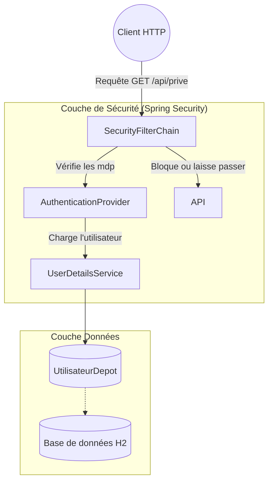

# 🛡️ Architecture Spring Boot Security (Basic Auth + Roles)

## Vue d'ensemble

Ce projet démontre comment mettre en place **Spring Boot Security** avec une authentification basée sur une base de données (JPA/H2) et la gestion des rôles (RBAC : Role-Based Access Control).

## 🏗️ Architecture : Spring Boot Security (Filtres)

<br/>



***

## 📁 Structure du projet

Voici la séparation classique des responsabilités :

```text
SpringBootSecurity/
├── pom.xml
└── src/main/java/com/exemple/securite/
    ├── ApplicationSecurite.java                // Point d'entrée
    ├── config/
    │   ├── ConfigSecurite.java                 // LE CŒUR : Configuration des filtres et droits
    │   └── InitialisateurDonnees.java          // Crée les utilisateurs de test au démarrage
    ├── controleur/
    │   └── APIControleur.java                  // Les routes /public, /prive et /admin
    ├── depot/
    │   └── UtilisateurDepot.java               // Accès à la base de données (JPA)
    ├── modele/
    │   └── Utilisateur.java                    // L'entité métier en base de données
    └── securite/
        ├── DetailsUtilisateurImpl.java         // Adaptateur : Modèle métier -> Format Spring Security
        └── ServiceDetailsUtilisateur.java      // Service appelé par Spring pour charger le compte
```

---

## 🛠️ Code Source et Explications

Les fichiers critiques de cette architecture sont dans les packages `config` et `securite`.

### 1. La configuration centralisée (`ConfigSecurite.java`)
C'est le *videur de la boîte de nuit*. Il décide des règles pour chaque chemin URL (`SecurityFilterChain`).
```java
http.authorizeHttpRequests(auth -> auth
    .requestMatchers("/api/public/**").permitAll()     // Accès libre
    .requestMatchers("/api/admin/**").hasRole("ADMIN") // Role requis
    .anyRequest().authenticated()                      // Reste : connexion requise
)
```

### 2. Le chargeur d'utilisateur (`ServiceDetailsUtilisateur.java`)
Quand l'utilisateur tape ses identifiants "Basic Auth", Spring n'a aucune idée de ce qu'est notre classe `Utilisateur`. Il demande à cette classe qui implémente `UserDetailsService` d'aller chercher en base de données.

### 3. L'Adaptateur (`DetailsUtilisateurImpl.java`)
Sert de traducteur entre notre classe `Utilisateur` et l'interface `UserDetails` que Spring Security utilise en interne pour vérifier le mot de passe et lire la liste des "Rôles".

---

## ✅ Avantages

- **Standardisé** : C'est *le* moyen officiel de faire de la sécurité en Java.
- **Délégation totale** : Notre contrôleur métier n'a même pas à vérifier les mots de passe.
- **Sécurisé par défaut** : Spring protège contre les attaques courantes (CSRF, Clickjacking, Session fixation) dès l'activation.
- **Extensible** : On peut facilement passer de *Basic Auth* à *JWT / OAuth2 / OpenID Connect (Google, Facebook)* simplement en modifiant `ConfigSecurite.java`.

## ❌ Inconvénients

- **Courbe d'apprentissage** : L'écosystème est massif (Filtres, Providers, Managers).
- **Verbosité des adaptateurs** : Oblige à mapper ses propres Entités BD vers les interfaces Spring (`UserDetails`).
- **Comportement magique** : Ce qui se passe "sous le capot" (les filtres Spring) est abstrait et parfois complexe à déboguer. (Exemple: Spring rajoute automatiquement le préfixe `ROLE_` devant les rôles).

## 📊 Commandes utilisées pour tester :

Le serveur contient 2 comptes :
* `francois` (mot de passe: `user123`) : **ROLE_USER**
* `alice_admin` (mot de passe: `admin123`) : **ROLE_ADMIN**

**Test 1 : Accès public (Sans compte)**
```bash
curl http://localhost:8080/api/public/bonjour
# Réponse : Bonjour (PUBLIC) ...
```

**Test 2 : Accès privé avec François**
```bash
curl -u francois:user123 http://localhost:8080/api/prive/profil
# Réponse : Bonjour (PRIVE) ! Vous êtes connecté en tant que 'francois' 
```

**Test 3 : François tente d'accéder au /admin (Tentative d'élévation de privilège)**
```bash
curl -u francois:user123 http://localhost:8080/api/admin/statistiques
# Réponse : Erreur 403 Forbidden (Accès Refusé)
```
