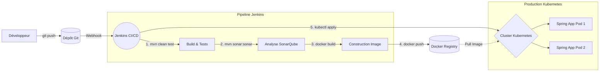

# Pipeline CI/CD Complet : Spring Boot ➔ Jenkins ➔ SonarQube ➔ Docker ➔ Kubernetes

Bienvenue dans ce guide étape par étape pour mettre en place une véritable usine logicielle (CI/CD) pour une application Java Spring Boot. 

---

## 1️⃣ Vue d'ensemble du flux CI/CD

L'objectif de cette pipeline est d'automatiser tout le processus : depuis le moment où un développeur pousse son code sur Git, jusqu'au moment où l'application est disponible pour les utilisateurs sur un cluster Kubernetes.

### Le flux de travail (Workflow) :
1. **Code (Git)** : Le développeur pousse son code.
2. **Build (Maven)** : Jenkins récupère le code, compile et lance les tests unitaires.
3. **Qualité (SonarQube)** : Le code est analysé pour vérifier sa fiabilité, sa sécurité et l'absence de bugs/vulnérabilités (Gate de qualité).
4. **Conteneurisation (Docker)** : Si la qualité est bonne, on package l'application (`.jar`) dans une image Docker isolée.
5. **Registre (Docker Hub / Harbor)** : L'image Docker est poussée vers un dépôt (Registry) pour être stockée de manière sécurisée.
6. **Déploiement (Kubernetes)** : Jenkins ordonne à Kubernetes de tirer cette nouvelle image et de mettre à jour l'application en production (sans coupure de service).

### Schéma de l'architecture

